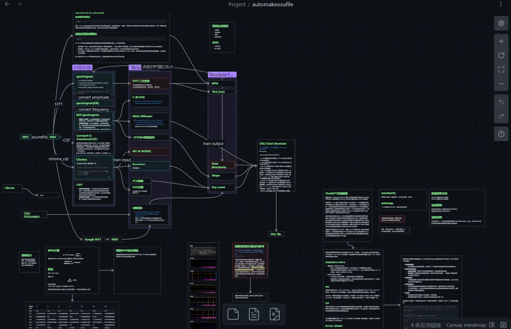

# AUTO MAKE OSU FILE (did not finished...)

osu自动做谱程序, 对音频文件进行分析后, 自动生成铺面, 由于谱面的数据可以分为时间维度和轨道维度, 我们可以用时频变换得到的频谱图与之对应, 广义来说, 一个频谱图就可以对应一个osu谱面, 只不过想要得到具有可玩性的谱面需要额外一些处理. 整个流程大致分为4步

1. 对MP3音频文件先转为WAV格式
2. 进行时频变换
3. 对变换结果进行处理
4. 根据官网给的osu谱面格式制作.osu谱面文件


## preview


---

## 1.转为WAV格式

比较简单, 对应代码在 `mp3_to_wav.py`

## 2.时频变换

可选的方法如下:

* 直接进行STFT得到spectrogram, 保留最全的信息
* 转换为DB的spectrogram, 仍然没有信息损失,或许会方便DB筛选
* mel power spectrogram
* Constant-Q Transform(CQT)
* Chroma_CQT 损失部分信息, 但可以看到转换成八度后的频谱, 类似钢琴谱

说实话我没有完全搞明白它们之间的关系, 也没有想好用哪个, 但是目前看来chroma稍微方便点

## 3.结果处理

由步骤2得到的数据通常是很复杂的频谱图, 还不能直接用, 我选择先对chroma频谱做二值化

接下来还没有完成, 我的想法是想办法对二值化后的数据降维, 这个降维应该是两个维度的:

* 对于轨道维度, 应该降维成想玩的k数, 比如想得到6k谱就从chroma的八度谱共12个音符降到6个轨道
* 对于时间维度, 由于音频成分复杂, 得到的谱面密度很高, 其中一些是无效的音, 可以尝试用能量密度来判断这个音是否有效, 具体方法我还没想好

## 4.写入osu文件

处理步骤在 `osu_file_make.py`中, 具体规则可以参考osu官网

### OSU 谱面结构

x,y,time,type,hitSound,addition

- x: note的横向位置，范围为0\~512，其中0表示最左侧，512表示最右侧。
- y: note的纵向位置，范围为0\~192，其中0表示最上方，192表示最下方。
- time: note的出现时间，以毫秒为单位，表示自谱面开始时间点的偏移量。
- type: note的类型，表示该note需要击打的方式。该参数是一个二进制数，其中1表示需要击打，0表示不需要击打。四种类型分别对应二进制数的四个位数，分别为：1、2、4、8。例如，如果type值为6，则表示该note需要使用键盘上的2和3键击打。
- hitSound: note的击打声音，表示播放的音效文件。该参数是一个二进制数，其中1表示需要播放，0表示不需要播放。四种声音分别对应二进制数的四个位数，分别为：1、2、4、8。例如，如果hitSound值为3，则表示播放第一个和第二个声音文件。
- addition: 额外参数，表示note的其他属性，如颜色、表现等。该参数的具体含义取决于谱面文件的作者和编辑器。

## 关于BPM

`bpm_calculate.py` 这个文件主要用于计算bpm, 第一个和最后一个note的时间

为什么要计算这些? 当然是为了给对音做个参考, 不过如果能够完全从频谱图中抽象出这些对音的时间戳且精度不错的话, 这个步骤就不用了

对音频做完时频变换后得到的时间戳单位unit是ms

一拍的间隔=bpm/60*1000, 则x分音的公式如下:

cent4_interval=bpm/60*1000/4

cent8_interval=bpm/60*1000/8

cent16_interval=bpm/60*1000/16

cent32_interval=bpm/60*1000/16

我测试了一下, 龙少女BPM=164的情况下, 16分音的间隔是88ms, 根据以上公式验证结果, 差不多正确


在高难的音游曲目中，每分钟的BPM可以超过180，有些高难曲目的BPM甚至在200到300以上

以BPM为300为例，计算16分音符的时间间隔：

时间间隔 = (1 / (300 / 60)) * 0.25 * 1000 ≈ 50 毫秒


# 运行环境

~由于cv2目前不支持python11, 所以用python10比较稳~

现在好像没用到cv2, 应该没有啥限制

---

# 项目重构和优化 (v2.0)
%% 2026/03/04 %%
项目经过重构，现在具有模块化的结构和改进的算法。

## 新项目结构

```
AutoMakeosuFile/
├── automakeosufile/     # 新模块化包（核心功能）
│   ├── __init__.py      # 包初始化
│   ├── config.py        # 配置文件
│   ├── audio_processing.py      # 音频处理模块
│   ├── feature_extraction.py    # 特征提取模块
│   ├── beatmap_generator.py     # 谱面生成模块
│   └── main.py          # 命令行入口
├── archive/             # 归档的旧代码（参考用）
├── audio/               # 音频文件
├── docs/                # 设计文档
├── output/              # 输出文件
├── picture/             # 图片
├── test/                # 测试文件
├── 密度修正专项/         # 密度修正实验
├── main.py              # 旧主程序（参考）
├── main_old.py          # 更旧版本（历史）
├── README.md            # 项目说明
└── requirements.txt     # 依赖
```

## 新版本特性

### 1. 模块化设计
- **audio_processing.py**: Mel频谱 + 自适应二值化
- **feature_extraction.py**: BPM检测 + 节拍对齐 + 轨道映射
- **beatmap_generator.py**: 完整的.osu文件生成

### 2. 算法改进
- **二值化**: 从固定阈值0.9 → 自适应阈值（激活率78.9%）
- **频谱分析**: 从Chroma CQT → Mel频谱（更适合音乐分析）
- **节拍对齐**: 新增BPM检测和节拍网格对齐
- **密度控制**: 新增轨道间隔控制和每拍音符限制
- **轨道映射**: 频率bin到音高类的智能映射

### 3. 使用方式

#### 命令行使用：
```bash
# 生成7K谱面
python -m automakeosufile.main audio/NIGHTFALL.mp3 --columns 7 --visualize

# 生成4K谱面
python -m automakeosufile.main audio/NIGHTFALL.mp3 --columns 4

# 自定义输出目录
python -m automakeosufile.main audio/NIGHTFALL.mp3 --output-dir my_output --columns 6
```

#### Python API使用：
```python
from automakeosufile import AudioProcessor, FeatureExtractor, BeatmapGenerator, Config

# 配置
config = Config()
config.DEFAULT_COLUMNS = 7

# 音频处理
processor = AudioProcessor(config)
audio_data = processor.process_audio("audio.mp3")

# 特征提取
extractor = FeatureExtractor(config)
features = extractor.extract_features(audio_data, audio_data['note_events'])

# 谱面生成
generator = BeatmapGenerator(config)
output_path = generator.generate_beatmap("audio.mp3", features)
```

## 文件说明

### 保留的核心文件
- `automakeosufile/` - 新模块化包（生产代码）
- `fileprocess/mp3_to_wav.py` - MP3转WAV工具
- `fileprocess/osu_file_parse.py` - OSU文件解析
- `密度修正专项/` - 密度修正实验
- `test_new_algorithm.py` - 新算法测试

### 归档的旧文件
- `archive/` - 旧代码归档（参考用）
  - `algorithm/` - 旧的算法实现
  - `fileprocess/` - 旧的文件处理
  - `plotfunction/` - 旧的绘图功能

## 运行环境

```bash
# 安装依赖
pip install -r requirements.txt

# 主要依赖
- librosa >= 0.10.0
- numpy >= 1.24.0
- opencv-python >= 4.8.0
- matplotlib >= 3.7.0
- scipy >= 1.11.0
```

## 项目历史

- **v1.0**: 初始版本，代码结构混乱
- **v2.0**: 重构版本，模块化设计，算法改进
- **当前状态**: 生产就绪，代码质量显著提升

## 自动复制到osu!歌曲目录

新版本增加了自动将生成的谱面复制到osu!歌曲目录的功能：

### 功能特点
1. **自动创建文件夹**: 在`D:\osu!\Songs\`目录下创建`{歌曲名}_automake`文件夹
2. **复制音频文件**: 将原始MP3文件复制到目标文件夹
3. **复制谱面文件**: 将生成的.osu文件复制到目标文件夹
4. **错误处理**: 如果osu!目录不存在会给出警告，不会中断程序

### 使用示例
```bash
# 生成4K谱面并自动复制到osu!歌曲目录
python -m automakeosufile.main audio/NIGHTFALL.mp3 --columns 4

# 输出结果示例：
# ✓ 音频文件复制到: D:\osu!\Songs\NIGHTFALL_automake\NIGHTFALL.mp3
# ✓ 谱面文件复制到: D:\osu!\Songs\NIGHTFALL_automake\NIGHTFALL_4K.osu
# ✓ 谱面已复制到osu!歌曲目录: D:\osu!\Songs\NIGHTFALL_automake
```

### 目录结构
```
D:\osu!\Songs\
├── NIGHTFALL_automake\
│   ├── NIGHTFALL.mp3          # 音频文件
│   └── NIGHTFALL_4K.osu       # 生成的谱面文件
├── 其他歌曲文件夹\
└── ...
```

## 未来改进方向

1. **长条检测优化**: 改进音符持续时间检测
2. **模式识别**: 识别音乐模式（连打、滑条等）
3. **难度分级**: 根据音符密度自动调整难度
4. **可视化增强**: 实时处理进度显示
5. **批量处理**: 支持多个音频文件批量生成
6. **自定义osu!目录**: 允许用户配置osu!安装目录
