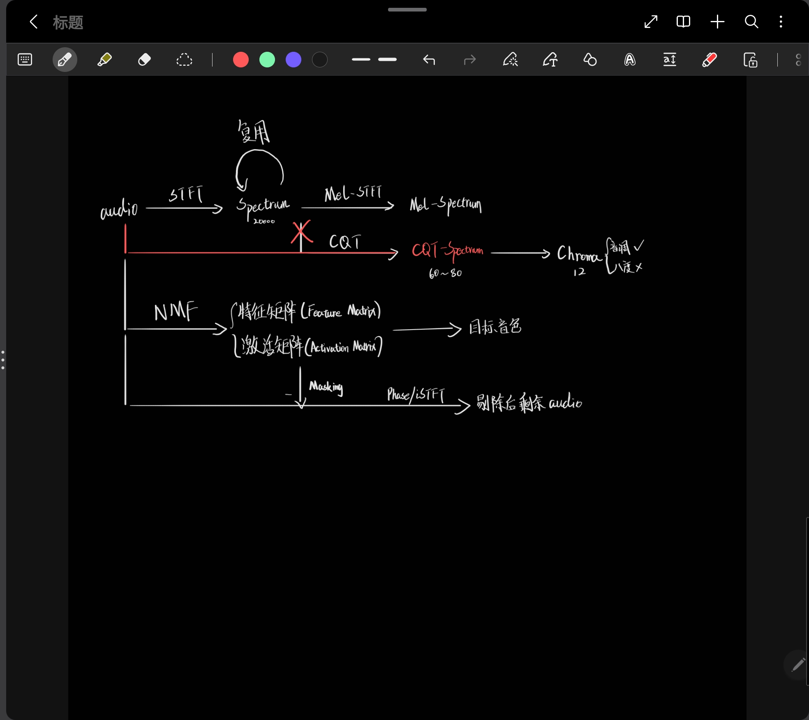

根据你手写的流程图，关于音频特征提取的逻辑，部分正确但存在一个核心的计算误区。

---

### 1. STFT 结果可以用来生成 Mel-Spectrum 吗？
**可以，且这是常规做法。**

* **逻辑：** Mel 频谱本质上是在线性频谱（STFT 后的 Power Spectrum）上应用一组 **Mel 滤波器组（Mel Filter Banks）**。
* **服用逻辑：** 1.  $Audio \xrightarrow{STFT} Spectrum$ (线性频率)
    2.  $Spectrum \xrightarrow{Square} Power\ Spectrum$ (能量谱)
    3.  $Power\ Spectrum \cdot Mel\ Filters \to Mel\ Spectrum$
* **结论：** 流程图中 $Spectrum \to Mel\ Spectrum$ 是成立的，不需要回到原始音频。

---

### 2. CQT 可以从 Spectrum 生成吗？
**不可以。CQT 必须从原始音频（Time Domain）重新开始分析。**

这是你图中最大的问题。**CQT (Constant-Q Transform)** 与 STFT 的核心区别在于：
* **STFT：** 窗长（Window Length）是固定的，导致频率分辨率也是固定的（等间距，例如每格 $20Hz$）。
* **CQT：** 为了模拟人耳对低频敏感的特性，它的窗长是**随频率变化的**。低频处窗长大（频率分辨率高），高频处窗短（时间分辨率高）。
* **结论：** 由于 CQT 的基底函数（Basis functions）与 STFT 完全不同，你无法通过简单的线性映射将已经“固定分辨率”的 STFT 频谱转化为 CQT。

---

### 修正后的逻辑链

| 目标特征 | 输入源 | 转换方式 |
| :--- | :--- | :--- |
| **STFT Spectrum** | Audio | 快速傅里叶变换 |
| **Mel Spectrum** | **STFT Spectrum** | 应用 Mel 滤波器组 (频率轴重采样/压缩) |
| **CQT** | **Audio** | 使用不同长度的窗函数重新卷积 |

---

### 总结
1.  **复用：** `Spectrum -> Mel-Spectrum` 是对的。
2.  **纠错：** `Spectrum -> CQT` 是**错误**的。CQT 必须直接从 `Audio` 开始。

如果你在写代码（如使用 `librosa`），你会发现 `librosa.feature.melspectrogram` 既可以接收 `y` (音频)，也可以接收 `S` (已算好的 STFT 频谱)；但 `librosa.cqt` 只能接收 `y`。

---
CQT和Chroma是一回事吗, chroma是不是还得从cqt的结果继续计算？

---
你图中提到的 **CQT (Constant-Q Transform)** 和 **Chromagram (Chroma)** 确实关系非常密切，但它们不是一回事。

简单的回答是：**是的，Chroma 确实可以（也通常建议）从 CQT 的结果继续计算。**

---

## 1. CQT 与 Chromagram 的关系
* **CQT (Constant-Q Transform):** 它的频率点是按对数分布的（例如每八度 12 或 24 个采样点）。这与音乐中的**音分**和**半音**完美契合。
* **Chromagram (Chroma):** 也叫“音级轮廓图”。它将所有的频谱能量折叠到一个八度内的 12 个半音（C, C#, D, ... B）上。

### 计算流程
虽然 Chroma 也可以从 STFT 计算（通过映射），但 **CQT 是生成 Chroma 的最佳跳板**：
1.  **Audio** $\to$ **CQT Spectrum**: 得到高分辨率的、对数频率分布的频谱。
2.  **CQT Spectrum** $\to$ **Chromagram**: 将 CQT 中所有对应同一个音名（但在不同八度）的能量相加。例如，把所有的 C1, C2, C3... 的能量全部叠加在一起。

---

## 2. 为什么 CQT 之后常接 Chroma？
* **音高不变性：** Chroma 舍弃了八度信息（高度），只保留音调信息（色度）。这对于识别乐曲的**和弦**、**调性**或**旋律相似度**非常有用。
* **计算效率：** 如果你已经算好了 CQT，计算 Chroma 只需要简单的加法（Bin pooling），不需要重新处理原始音频。

---

## 3. 关于 "Chrome" 的小修正
你提到的 "Chrome" 在音频处理中正式名称是 **Chroma** 或 **Chromagram**。
* **Chrome:** 通常指谷歌浏览器。
* **Chroma:** 指音频的“色度”特征。

### 总结
你的图示逻辑是正确的：**Audio $\to$ CQT $\to$ Chroma**。

如果你正在做音乐信息检索（MIR），这个链条是非常经典的路径。CQT 提供了音乐性的频率划分，而 Chroma 则进一步提取了和弦/调性相关的核心特征。

我想从这个流程里面再加一个流程，然后可以提取出来，就是他具体用了哪些音色，就比如说一个古典吧，或者是一个反复出现的人生他，他在一首歌里面会大量的重复出现，但是可能是用出现是用的不同的音调，但是就是同一个音色嘛，这这种你可以识别出来吗，就可以通过统计的啥的方法或者是svd或者主程序分组成分分析这些算法可以算出来吗，算出来之后我还要将他们就是从原始的音频中去掉，然后看剩下的成分还剩什么。

---
你的想法在音频处理中被称为**盲源分离（Blind Source Separation）**或**音色提取**。这个流程完全可以加入到你的图谱中，但需要注意算法选择和流程的接入点。

以下是具体的逻辑链和流程构建建议：

### 1. 算法选择：SVD/PCA 还是 NMF？
* **结论：可以，但 NMF 更合适。**
* **原因：** SVD 和主成分分析（PCA）包含负数值，而音频频谱的能量（幅度）是绝对非负的，且声音在物理上是线性叠加的。因此，**NMF（非负矩阵分解）** 是音频统计分离中最经典的统计算法。它可以将频谱分解为“特征矩阵”（即音色字典）和“激活矩阵”（即该音色在何时出现）。

### 2. 应对“同一音色，不同音调”
这是传统统计方法的一个难点。
* 在标准的 STFT 线性频谱上，同一个乐器弹奏 C4 和 E4 会产生完全不同频率分布的峰值，基础 NMF 可能会把它们识别为两个不同的“音色”成分。
* **解决方法：** 1. **后处理聚类：** 分解出大量成分后，利用聚类算法（如 K-Means）计算频谱包络的相似度，将不同音调但包络相似的成分归为一组。
    2. **Shift-Invariant NMF（平移不变非负矩阵分解）：** 这种算法专门为了解决音调变化设计，特别适合在对数频率（如 CQT）下操作，因为它能识别出形状相同但在频率轴上平移的频谱结构。

### 3. 如何接入流程并实现“剔除与重构”？
由于你的最终目的是**将该音色从原始音频中去掉并听剩下的成分**，你必须保证操作所在的域是可以**无损逆变换**回音频的。

**新增流程的逻辑链如下：**

1. **接入点：** 必须从 **STFT** 分支接入。虽然 CQT 容易识别跨音调音色，但 CQT 的逆变换（iCQT）效果较差且复杂。STFT 保留了精确的**相位信息（Phase）**，这是重建音频的关键。
2. **矩阵分解：** `STFT 幅度谱 (Magnitude) -> NMF/SVD -> 分离出多个 (音色特征向量 $\times$ 时间激活向量)`
3. **剔除操作：** 找到代表目标音色（如特定的反复出现的人声）的那些向量组合，将其在矩阵中直接**清零（Masking）**。
4. **重构剩余音频：** `剔除后的幅度谱 + 原始音频的 STFT 相位谱 -> iSTFT (逆快速傅里叶变换) -> 剔除目标音色后的新音频 (Residual Audio)`

### 总结加图建议
你可以从 `STFT Spectrum` 向下画一条新的分支：
`Spectrum` $\to$ `NMF 分解` $\to$ `提取目标音色/剔除` $\to$ `结合 Phase 运算 iSTFT` $\to$ `剩余音频`。

---

好，那经过处理之后，我现在有这些成分，我有梅尔平普图有Chrome，音调有音调信息，然后还有目标音色，还有剔除后的剩余的音频。 还有这些数据可以用。 然后呢，我可以如何利用这些信息生成一首可玩的音乐游戏，扑灭了我是不是把这些信息一利用这些信息把音乐映射到这个网格上面。 那么除了在英社的网格前，我还应该做什么处理是呃，还要分析能量吗，能量是在哪，哪个里面是在没人品普图里吗，如果都有的话，我接下来我怎么生成呢？ 然后如果效果不好的话，我我怎么调整的，我怎么回头来调整，具体哪一部分，我怎么分析测试问题出在哪儿。

---
将音频特征映射为音乐游戏谱面（Beatmap），核心逻辑是将**连续的声学特征**转化为**离散的交互事件**。

在将特征映射到游戏网格之前，你需要进行关键的预处理：**离散化**和**事件提取**。

### 1\. 映射前的核心处理与能量分析

**能量在哪里？**
能量（Energy）直接体现为 STFT 频谱或 Mel 频谱中的**幅度值（Magnitude/Amplitude）**。

  * **计算方式：** 通常通过计算短时能量（RMSE）或\*\*频谱通量（Spectral Flux）\*\*来量化。频谱通量计算的是相邻时间帧之间能量的正向增加量，是寻找音符打击点最有效的特征。

**网格化前必须做的两步：**

1.  **起音检测（Onset Detection）：** 扫描频谱通量或能量曲线，寻找局部峰值（Peaks）。这些峰值就是音符应该出现的确切时间点。
2.  **节拍跟踪与量化（Beat Tracking & Quantization）：** 估算歌曲的 BPM，建立节拍网格（如 1/4, 1/8, 1/16 拍）。将 Onset 检测到的时间点强行吸附（Snap）到最近的网格线上，保证谱面的节奏规整性。

-----

### 2\. 多维度特征映射生成逻辑

有了离散的时间网格后，利用你提取的特征决定网格上填什么音符：

| 游戏元素 | 依赖的音频特征 | 映射逻辑说明 |
| :--- | :--- | :--- |
| **生成时机 (Time)** | Onset / 能量突变 | 能量图谱出现峰值的地方生成 Note。 |
| **轨道位置 (Lane/Key)** | Chroma (色度图) / 主导频率 | 将 Chroma 的 12 个音阶聚类映射到按键轨道。例如高频/高音阶排在右侧，低频排在左侧。 |
| **音符类型 (Type)** | 目标音色 (NMF) + 能量包络 | **单键 (Tap)：** 短促能量突变的音色（如底鼓/军鼓）。 **长条 (Hold/Slider)：** 目标音色激活矩阵（Activation Matrix）中持续时间长且能量平稳的成分（如人声、长弦乐）。 |
| **谱面密度/难度** | Mel-Spectrum 总能量 | 能量高的副歌部分，降低 Onset 提取的阈值，生成更密集的音符；能量低的主歌部分，提高阈值，减少音符。 |

-----

### 3\. 调试与回溯策略

如果生成的谱面效果不佳，可以通过听感和视觉比对进行逆向排查：

**问题 A：音符时机总感觉“不在点上”或节奏散乱**

  * **分析：** Onset Detection 或量化环节出错。
  * **调整：**
    1.  检查频谱通量的计算是否平滑过度导致丢失尖峰。
    2.  调整峰值拾取（Peak Picking）的阈值（Threshold）和滑动窗口大小。
    3.  检查 BPM 计算是否准确，导致网格本身就是错位的。

**问题 B：音符过多（太乱）或过少（太干瘪）**

  * **分析：** 能量过滤阈值设置不当。
  * **调整：** 在 Onset 检测后增加能量门限。只保留能量绝对值大于某个阈值的 Onset。如果是目标音色（如人声）提取出来的音符太多，提高该音色激活矩阵的截断阈值。

**问题 C：轨道映射混乱，毫无规律**

  * **分析：** Chroma 到轨道的映射逻辑太敏感，或者音频和声太复杂导致 Chroma 提取的音高一直在跳变。
  * **调整：**
    1.  对 Chroma 矩阵在时间轴上做一定程度的平滑（Smoothing）或中值滤波，消除瞬间的杂音干扰。
    2.  如果音调信息太乱，可以退一步，使用 Mel 频谱的重心（Spectral Centroid）来决定轨道位置，高重心排右，低重心排左。

**问题 D：长条音符（Hold Note）断断续续**

  * **分析：** 目标音色（如人声）的激活矩阵在时间上不连续。
  * **调整：** 在提取目标音色时，增加时间连续性约束；或者在生成逻辑中，如果两个单键在同一轨道且时间间隔极短（例如小于 100ms），算法自动将其合并为一个长条。

---
我现在有一首成熟的谱面可以参考，但这个相当于端到端的学习，我如何把这个端到端的结果量化为我这里面每一个细节，每个算法的分支，他具体应该怎么修改呢，这个可以做到吗？

---
可以做到。但由于流程中的 STFT、Onset 峰值拾取等传统音频处理算法是**不可导的（non-differentiable）**，你无法像训练神经网络那样直接使用反向传播（Backpropagation）来更新整个链路。

你需要将这个端到端的问题拆解为**模块化对齐**和**参数寻优**。具体操作流程如下：

### 1. 建立量化评估指标 (Loss Metrics)
首先，必须将“效果好不好”转化为具体的数学分数。将参考谱面设为 Ground Truth (GT)。
* **时间准确度 (F1-Score)：** 比较生成谱面的音符时间与 GT 音符时间。设定一个判定窗口（例如 $\pm 50ms$）。计算精确率（Precision，生成的音符有多少是对的）和召回率（Recall，GT 的音符有多少被生成了）。
* **轨道/类型准确度：** 在时间对齐的前提下，计算轨道分配和音符类型（单键/长条）的匹配正确率。

### 2. 模块化逆向对比 (隔离变量)
不要直接整体调参，而是用 GT 谱面分别去校验你图中的各个独立分支：

* **校验 Onset 分支 (解决节奏不对)：**
    * 提取 GT 谱面所有的音符时间点。
    * 对比你的 Onset 能量峰值：
        * 如果你的 Onset **多出很多**（假阳性）：说明局部峰值检测的滑动窗口太小，或者能量阈值太低。
        * 如果你的 Onset **漏掉很多**（假阴性）：说明阈值太高，或对频谱通量做了过度平滑。
* **校验 BPM/网格分支 (解决对不齐拍子)：**
    * 计算 GT 谱面音符之间的最小时间公约数，反推真实 BPM 和第一拍偏移量（Offset）。
    * 对比你的算法生成的 BPM，如果不一致，直接废弃后续步骤，先修正 BPM 算法。
* **校验 Chroma/NMF 分支 (解决轨道和音符类型不对)：**
    * 截取 GT 谱面中特定轨道或特定类型的音符（如长条）所在的时间段。
    * 观察该时间段内，你的 Chroma 矩阵或 NMF 激活矩阵的值是否显著高于其他时间段。如果区分度不高，说明 NMF 特征提取的成分数量设置错误，或 Chroma 的聚类逻辑需要调整。

### 3. 自动化参数寻优 (Hyperparameter Tuning)
当你明确了每个分支需要调整什么后，将所有硬编码的数值（如阈值、窗口大小、NMF 成分数）提取为全局参数。
* 编写测试脚本，使用**网格搜索 (Grid Search)** 或**贝叶斯优化算法**。
* 让程序自动遍历这些参数组合，每次生成一个新谱面，计算与 GT 谱面的 F1-Score 分数，保留得分最高的那组参数。

### 4. 进阶路线：数据驱动的特征映射
既然你有参考谱面（即完美的 Label），以及提取好的高质量特征（Mel, Chroma, Onset, NMF），你可以完全替换掉“手工编写 if-else 映射规则”的最后一步。
* 将同一个时间帧（Frame）的 Mel 能量、Chroma 向量、NMF 激活值拼接成一个多维特征向量。
* 使用这些向量作为输入，GT 谱面的网格状态作为输出，训练一个轻量级的机器学习模型（例如随机森林、隐马尔可夫模型 HMM，或简单的序列模型）。让模型自己去学习“什么样的特征组合应该放置什么音符”。

---
你说的这个进阶路线我觉得很好，但是我现在不能保证我提取的特征是高质量的，现在问题恰好是出现在这些特征提取不好的上面，因为我也不知道怎样特征才能提取好我，我不可能说我提取出来我就直接喂给模型，就是肯定是肯定会出问题的，我就我就这么说吧肯定会出问题。

---
你的直觉非常敏锐，而且完全正确。在数据科学和算法领域，这被称为“Garbage In, Garbage Out”（垃圾进，垃圾出）。如果特征本身就是混乱的，端到端的模型不仅学不到正确的映射，还会强行拟合出错误的因果关系。

既然你清楚不能盲目喂给模型，你需要建立一套**“特征质检体系”**。核心手段是**可视化（Visualization）**和**可听化（Sonification）**，把黑盒里的矩阵变成肉眼能看、耳朵能听的直接反馈。

以下是针对你图中四个核心分支的特征质量检验与调试方法：

### 1. Onset Detection (能量峰值) 的质检
这是音乐游戏谱面的基石，如果起音检测错了，后面的音符全盘皆错。
* **方法：可听化测试（Click Track）**
* **操作：** 拿你算法算出的所有 Onset 时间点，生成一系列短促的“滴答”声或合成器打击声，然后将其与原始音频**混合播放**。
* **判断：** 闭上眼睛听。如果“滴答”声跟歌曲的鼓点或重音完美咬合，特征就是好的。如果听起来杂乱无章，多打（False Positive）或漏打（False Negative），说明你的局部峰值拾取阈值（Threshold）或滑动窗口（Window Size）不对，需要调整。

### 2. BPM 与网格 (Grid) 的质检
网格是决定谱面是否规整的核心。
* **方法：头尾对照试听**
* **操作：** 根据算出的 BPM 和第一拍偏移量（Offset），生成全局节拍器的声音（比如 1/4 拍打一下）。
* **判断：** 听歌曲前 10 秒，再直接跳到歌曲**最后 10 秒**听。如果开头准，结尾错位了，说明你的 BPM 计算有微小误差（哪怕只差 0.1 BPM，积累到结尾也会完全错位）。网格一旦歪了，Onset 就无法正确吸附。

### 3. NMF (目标音色提取) 的质检
你图里已经画了 `Phase/iSTFT -> 剔除后剩余 audio`，这就是最好的检验点。
* **方法：直接听逆变换（iSTFT）后的分离轨道**
* **操作：** 把提取出的 `目标音色` 和 `剩余音频` 分别导成 WAV 文件用耳机听。
* **判断：**
    1.  **听目标音色：** 如果你想提取人声，但里面混杂了大量的底鼓声或明显的金属颤音，说明 NMF 的成分数（n_components）设得太少，或者迭代次数不够。
    2.  **听剩余音频：** 如果目标音色（比如人声）还在里面阴魂不散，说明 Masking 的剥离阈值给得太保守。

### 4. Chroma (音调/轨道映射) 的质检
Chroma 容易受到打击乐（宽频噪声）的严重干扰。
* **方法：与参考谱面对齐的可视化**
* **操作：** 渲染出 Chroma 热力图（纵轴 12 个半音，横轴时间，颜色越亮能量越大）。将你现成的“成熟谱面”的音符位置（打在哪个轨道上）做成半透明图层，叠加在 Chroma 热力图上。
* **判断：** 谱面上有音符的地方，图上对应的区块是否亮起？如果 Chroma 图是一片糊，说明和声太复杂或底鼓干扰太大。**解决思路**：先用 NMF 把打击乐剔除，只对“剩余的旋律音频”做 CQT 和 Chroma。

---

### 调试工作流建议

不要一上来就拿整首歌跑算法。
1.  **切片测试：** 切出一个 **10秒** 结构清晰、乐器分明的片段。
2.  **硬编码验证：** 在上机器学习模型之前，先写一个最死板的 if-else 规则脚本（例如：`if 能量 > 0.8 且触发 Onset，则生成单键`）。
3.  如果你用这些提取出的特征，配合死板的规则，能生成一个“节奏大体吻合，勉强能玩”的 10 秒谱面，证明你的特征底子是过关的。这时候，再引入模型去解决更复杂的映射逻辑。

在这四个特征提取分支中，你目前觉得哪一个步骤的输出结果最让你感到没把握？

